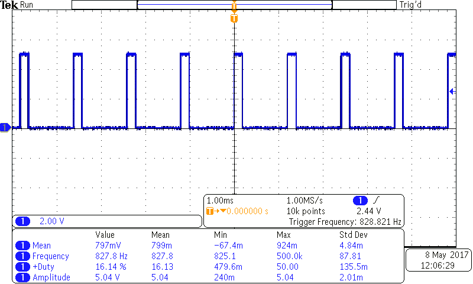
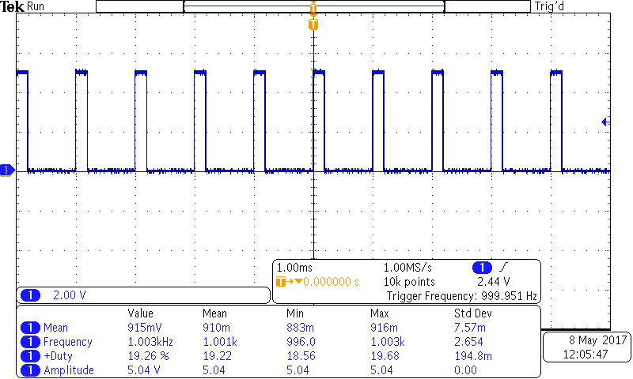

# Using timer interrupts

A discrete time controller is designed for a fixed _sample rate,_
i.e. the frequency at which it reads sensor data and updates actuator commands.

So how can we set a fixed sample rate using Arduino?
Suppose we have a piece of code which should be run every 1 ms, i.e. at 1 kHz sample rate.
A naïve approach would be to use the `delay()` function:

```c
int foo = 0;
float a = 0.0;
float b = 0.0;
float c = 0.0;

const byte outputPin = 12;

void setup() {
    pinMode(outputPin, OUTPUT);
}

void loop() {
    digitalWrite(outputPin, HIGH);

    // Do some nonsense
    foo = analogRead(A0);
    a = foo/42.0;
    b = a*a;
    c = b + a + 10.0;
    c *= c;
    b -= c;

    digitalWrite(outputPin, LOW);

    // Wait 1 ms -- hopefully it will result in 1 kHz sample rate?
    delay(1);
}
```

This code works and we can measure the signal on pin 12 using a scope:


Unfortunately, we see that the floating-point computations need some time and
the sample rate is not 1 kHz, but rather ≈830 Hz.
One could tweak the delay value so that together with computation time it leads
to exactly 1 ms period, but this is 1) very tiresome; 2) not possible if the computation
time varies, e.g. when you have branching code.

So what should we do? The answer is to use a hardware timer and an interrupt routine:

```c
int foo = 0;
float a = 0.0;
float b = 0.0;
float c = 0.0;

const byte outputPin = 12;

void setup() {
    pinMode(outputPin, OUTPUT);

    // Reset timer settings
    TCCR1A = 0;
    TCCR1B = 0;
    TCNT1  = 0;

    // Set 1 kHz frequency
    // f = 16 MHz / (count_value * prescaler)
    OCR1A = 16000; // count_value

    TCCR1B |= _BV(WGM12); // set the "clear timer on compare match" (CTC) mode
    TCCR1B |= _BV(CS10); // set the prescaler to 1

    TIMSK1 |= _BV(OCIE1A); // enable interrupt on match
}

// Interrupt routine called on timer compare match
ISR(TIMER1_COMPA_vect) {
    digitalWrite(outputPin, HIGH);

    // Do some nonsense
    foo = analogRead(A0);
    a = foo/42.0;
    b = a*a;
    c = b + a + 10.0;
    c *= c;
    b -= c;

    digitalWrite(outputPin, LOW);
}

void loop() {
}
```

Using timer leads to an exact and consistent sample rate:

